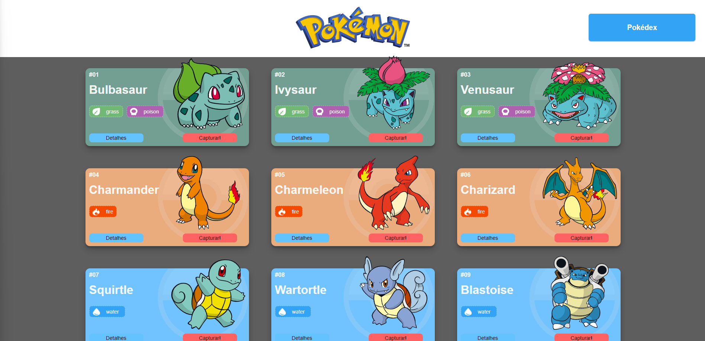
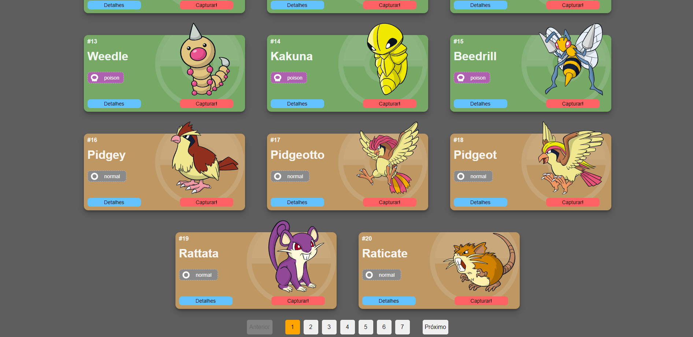
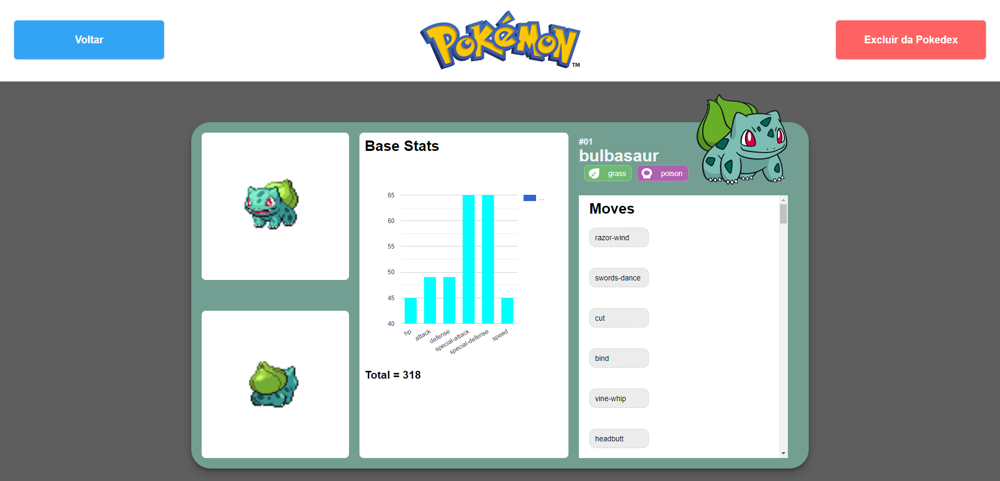
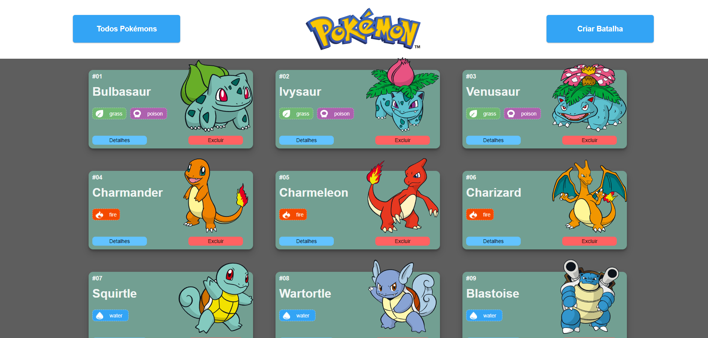
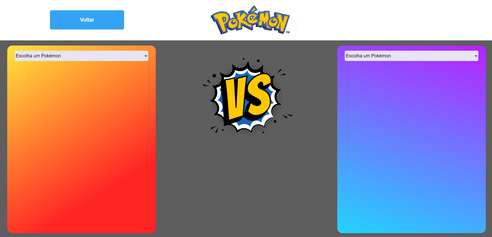
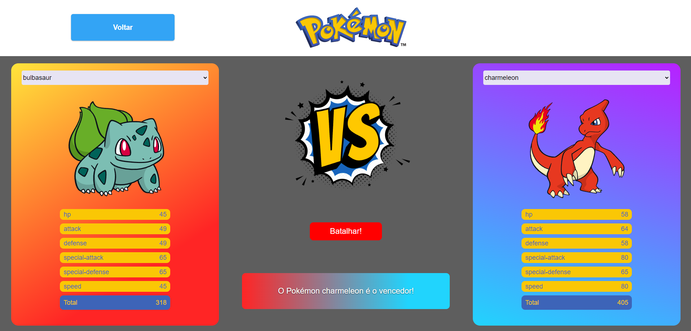

# `Projeto`
Projeto Pokédex

# `Link`
https://pokedex-alves1.surge.sh

# `Descrição`
O Projeto Pokédex foi desenvolvido como uma atividade dentro do curso Full-Stack Web Developer da Labenu, o qual consiste em requisições (via axios) para a PokéApi, que é uma API pública* com informações relacionadas aos Pokémons.
Trata-se de uma ferramenta onde o usuário pode verificar os detalhes de todos os Pokémons, adicionar os mesmos a sua Pokédex e também criar batalhas entre Pokémons para ver qual é o vencedor.
*a API pode ser encontrada [aqui](https://pokeapi.co/)
 
O repositório do projeto pode ser encontrado [aqui](https://github.com/future4code/Alves-pokedex1)

# `Modo de usar`
Ao iniciar a ferramenta o usuário pode ver uma lista com vinte cards de Pokémons, e, na parte inferior da lista existe uma paginação, onde o usuário pode clicar em outras páginas para carregar mais Pokémons. Nestes cards, o usuário pode clicar em "Detalhes" ou em "Capturar!".
 
Caso o usuário, no card, clicar em "Detalhes", ele será redirecionado para outra página, onde encontrará alguns detalhes do Pokémon selecionado: uma foto de frente e outra de costas, os valores de Base Stats que são: HP, Attack, Defense, Sp. Atk, Sp. Def e Speed, também o ID, Nome, os Tipos do Pokémon e seus Moves.
 
Caso o usuário, no card, clicar em "Capturar!", este Pokémon automaticamente será adicionado na Pokédex, que é uma lista com os Pokémons adicionados pelo usuário.
 
No canto superior direito da tela, existe uma botão chamado "Pokédex". Ao clicar neste o usuário é redirecionado para a página onde estão os cards de todos aqueles adicionados à Pokédex.
 
No canto superior direito da página Pokédex existe um botão chamado "Criar Batalha". Ao clicar neste botão o usuário é redirecionado para uma página onde ele pode selecionar dois Pokémons. As opções que aparecem nesta seleção são apenas os Pokémons que já estão adicionados à Pokédex. Ao selecionar os Pokémons, suas imagens são exibidas abaixo do nome e também um botão chamado "Batalhar!", que, ao ser clicado exibe na tela os valores de "Base stats" de cada Pokémon, assim como a soma total destes. O Pokémon vencedor é aquele que possuir o maior valor total e uma mensagem na tela informa quem o é.

# `Instalando e rodando o projeto`
Fazer o clone do projeto:
- git clone link-do-repositório

Instalar as dependências:
- npm install

Rodar o projeto:
- npm run start

# `Tecnologias utilizadas`

# `Autores`
Olavo Marques do Nascimento; Márleo Piber da Rosa; Evandro Paulo Folletto.

# `Imagens`
### Página Home

### Página Home

### Página Detalhe

### Página Pokédex

### Página Batalha

### Página Batalha
